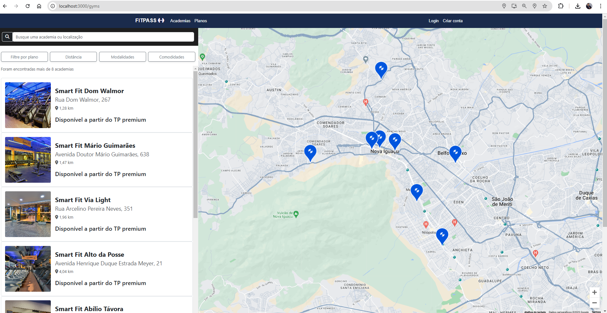
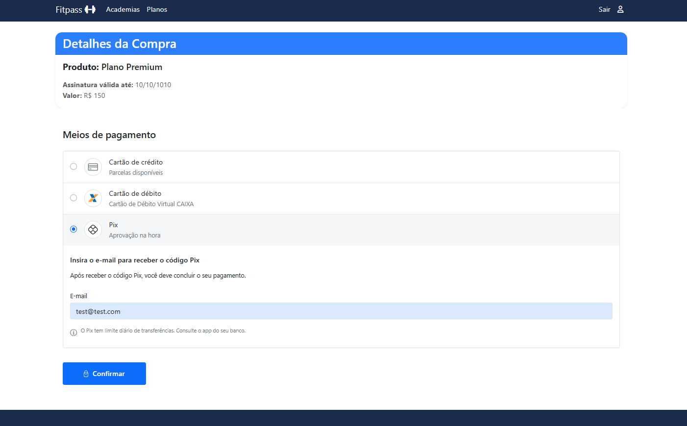

# FitPass 


## 📌 Sobre o Projeto

O **FitPass** é uma aplicação desenvolvida em **Ruby on Rails** para facilitar a conexão entre usuários e academias. Inspirado na experiência de plataformas como **TotalPass**, o sistema permite que usuários encontrem academias próximas utilizando **geolocalização** e realizem pagamentos através de um **gateway de pagamento integrado**.

## 🚀 Tecnologias Utilizadas

- **Ruby on Rails** - Framework principal para desenvolvimento web
- **PostgreSQL** - Banco de dados relacional
- **Devise** - Autenticação e gerenciamento de usuários
- **Geocoder** - Biblioteca para geolocalização
- **StimulusJS** - Framework leve para interatividade no frontend
- **Google Maps API** - Exibição de mapas e cálculo de distância entre usuário e academias
- **Bootstrap** - Estilização da interface
- **Sidekiq** - Processamento de tarefas em background (em breve)
- **Gateway de Pagamento** - Implementação para processar pagamentos com segurança

## 🔥 Funcionalidades

✔️ Cadastro e autenticação de usuários via **Devise**  
✔️ Geolocalização para exibir academias próximas ao usuário  
✔️ Exibição de academias em um **mapa interativo**  
✔️ Cálculo de **distância real** entre usuário e academia usando **Google Maps API**  
✔️ Integração com **gateway de pagamento** para compra de planos  
✔️ Pesquisa de academias por nome e localização(em breve)

✔️ Gestão de horários de funcionamento das academias (em breve)

## 🗺️ Geolocalização e Mapas

A aplicação utiliza **Geocoder** para armazenar a latitude e longitude das academias. Além disso, com o **Google Maps API**, conseguimos calcular a distância real até uma academia considerando o trajeto pelas ruas, garantindo uma melhor experiência ao usuário.



## 💳 Integração com Gateway de Pagamento

O **FitPass** possui integração com um **gateway de pagamento** para permitir que os usuários adquiram planos de academia de forma segura. A experiência inclui:

- Cadastro de métodos de pagamento
- Processamento seguro de transações
- Notificações sobre status de pagamento (em breve)



## 🏗️ Estrutura do Banco de Dados

A aplicação possui algumas tabelas principais:

- **Users**: Usuários cadastrados (autenticados via Devise)
- **Gyms**: Academias cadastradas no sistema
- **Addresses**: Endereços vinculados às academias
- **GymHours**: Horários de funcionamento das academias
- **Contacts**: Informações de contato das academias

## 📂 Como Rodar o Projeto Localmente

### 1️⃣ Clonar o Repositório
```bash
git clone https://github.com/MohamedCuerci/fitpass.git
cd fitpass
```

### 2️⃣ Configurar as Dependências
```bash
bundle install
rails db:create db:migrate db:seed
```

### 3️⃣ Configurar Variáveis de Ambiente
Crie um arquivo **.env** na raiz do projeto e adicione:
```bash
GOOGLE_MAPS_API_KEY=sua_chave_aqui
GATEWAY_API_KEY=sua_chave_de_pagamento_aqui
```

### 4️⃣ Iniciar o Servidor
```bash
rails s
```
Acesse **http://localhost:3000** no navegador.

## 📌 Contribuição
Sinta-se à vontade para abrir issues e pull requests para melhorar o FitPass! 🚀

## 📜 Licença
Este projeto é open-source e distribuído sob a licença MIT.
